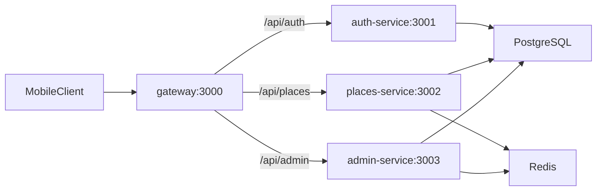
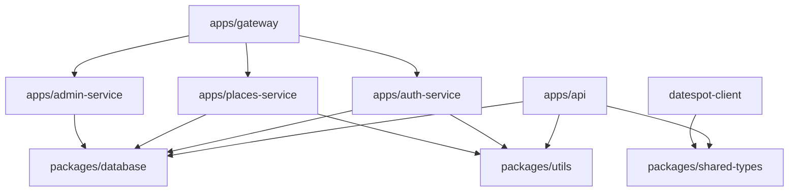

# DateSpot Server — Architecture

Orchestration map for the `datespot-server` pnpm + Turborepo monorepo.

## Dual runtime modes

The repo supports two ways to run the API. Both expose the same URL paths under `/api/*` on port 3000.

| Mode | Command | What runs |
|------|---------|-----------|
| **Local dev (monolith)** | `pnpm dev` | [apps/api](../apps/api) — all routes in one Express app |
| **Docker (microservices)** | `docker compose up --build` | Split services + [apps/gateway](../apps/gateway) nginx proxy |

**Behavior drift (documented, not yet unified):**

- `auth-service` applies login rate limiting; `apps/api` does not.
- `places-service` and `admin-service` use Redis caching; `apps/api` does not implement Redis despite `REDIS_URL` in its env schema.

When changing API behavior, update the relevant microservice **and** the matching route file in `apps/api` unless the task explicitly targets one mode only.

## Monorepo map

| Path | Package / service | Port | Role |
|------|-------------------|------|------|
| `apps/api` | `api` | 3000 (local) | Monolith for `pnpm dev` — all routes |
| `apps/auth-service` | `auth-service` | 3001 (internal) | `/api/auth` — registration, login, password change |
| `apps/places-service` | `places-service` | 3002 (internal) | `/api/places` — list, detail, save/unsave |
| `apps/admin-service` | `admin-service` | 3003 (internal) | `/api/admin` — stats, places CRUD, user management |
| `apps/gateway` | — | 3000 (external) | nginx reverse proxy to microservices |
| `packages/database` | `@datespot/database` | — | Prisma schema, migrations, seed |
| `packages/shared-types` | `@datespot/shared-types` | — | Shared TypeScript types (sync with client) |
| `packages/utils` | `@datespot/utils` | — | Haversine distance, password generation |

## Request flow (Docker)

Gateway routing is defined in [apps/gateway/nginx.conf](../apps/gateway/nginx.conf):

| Path prefix | Upstream |
|-------------|----------|
| `/api/auth` | `auth-service:3001` |
| `/api/places` | `places-service:3002` |
| `/api/admin` | `admin-service:3003` |
| `/health` | Gateway stub (200 OK) |

Infrastructure services (Docker only): `postgres`, `redis`, `db-init` (migrations + seed).

## Dependency graph

- All Express apps import Prisma via `@datespot/database`.
- `auth-service`, `places-service`, and `admin-service` are independent; they share no code beyond workspace packages.
- `apps/api` duplicates route logic from the three microservices for local development.
- `packages/shared-types` must stay aligned with `datespot-client/packages/shared-types`.

## Cross-cutting concerns

| Concern | Location | Notes |
|---------|----------|-------|
| Database | `packages/database` | Single Prisma schema; all services connect via `DATABASE_URL` |
| JWT auth | Each service's `middleware/auth.middleware.ts` | Shared `JWT_SECRET`; token payload includes `userId`, `isAdmin`, `subscriptionTier` |
| Env validation | Each app's `src/config/env.ts` | Zod schemas; fail fast at startup |
| FREE tier lock | `places-service` / `apps/api` places routes | First 5 places unlocked; rest marked `isLocked` |
| Redis cache | `places-service`, `admin-service` | Key prefix `places:list:*`, TTL 120s; invalidated on admin place mutations |
| i18n | Places routes | Query param `language`: `he`, `en`, `ar` |
| Admin UI | Mobile client | This repo exposes `/api/admin/*` only; no web admin panel |

## Where to change what

| Task | Start here |
|------|------------|
| New auth endpoint | `apps/auth-service/src/routes/` + `apps/api/src/routes/auth.routes.ts` |
| Login rate limiting | `apps/auth-service/src/routes/auth.routes.ts` |
| Places list / detail / save | `apps/places-service/src/routes/` + `apps/api/src/routes/places.routes.ts` |
| FREE / premium lock logic | `apps/places-service/src/routes/places.routes.ts` |
| Redis places cache | `apps/places-service/src/lib/redis.ts` |
| Admin stats / CRUD | `apps/admin-service/src/routes/` + `apps/api/src/routes/admin.routes.ts` |
| Cache invalidation | `apps/admin-service/src/lib/redis.ts` |
| Gateway routing | `apps/gateway/nginx.conf` |
| Schema / migration | `packages/database/prisma/schema.prisma` |
| Seed data | `packages/database/prisma/seed.ts` |
| API response types | `packages/shared-types/src/index.ts` (+ sync client) |
| Distance / password helpers | `packages/utils/src/index.ts` |
| Docker stack | `docker-compose.yml` |

## Mobile client

The Expo app and HTTP client live in the sibling repo:

- [datespot-client/README.md](../../datespot-client/README.md)
- [datespot-client/packages/shared-types/README.md](../../datespot-client/packages/shared-types/README.md)

Configure the mobile app with `EXPO_PUBLIC_API_URL=http://localhost:3000` (or Railway URL in production).

## Documentation index

| Doc | Audience | Purpose |
|-----|----------|---------|
| [README.md](../README.md) | Humans | Quick start, env, scripts, deploy |
| [AGENTS.md](../AGENTS.md) | AI agents | Conventions, boundaries, verification |
| This file | Everyone | Monorepo map and task routing |
| [apps/api/README.md](../apps/api/README.md) | API work | Monolith local dev |
| [apps/auth-service/README.md](../apps/auth-service/README.md) | Auth work | Registration, login, passwords |
| [apps/places-service/README.md](../apps/places-service/README.md) | Places work | List, detail, save, caching |
| [apps/admin-service/README.md](../apps/admin-service/README.md) | Admin work | Stats, CRUD, users |
| [apps/gateway/README.md](../apps/gateway/README.md) | Gateway work | nginx routing |
| [packages/database/README.md](../packages/database/README.md) | DB work | Prisma, migrations, seed |
| [packages/shared-types/README.md](../packages/shared-types/README.md) | Types work | Type sync with client |
| [packages/utils/README.md](../packages/utils/README.md) | Utils work | Shared helpers |
